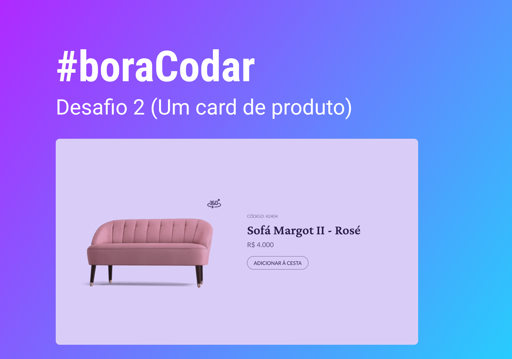

<h1 align="center"> Card de Produto </h1>

  <a href="#-tecnologias">Tecnologias</a>&nbsp;&nbsp;&nbsp;|&nbsp;&nbsp;&nbsp;
  <a href="#-projeto">Projeto</a>&nbsp;&nbsp;&nbsp;|&nbsp;&nbsp;&nbsp;
  <a href="#-layout">Layout</a>

 

  

## 🚀 Tecnologias

Esse projeto foi desenvolvido com as seguintes tecnologias:

- HTML e CSS
- JavaScript
- Git e Github

## 💻 Projeto

Este projeto foi desenvolvido para o desafio semanal #boraCodar promovido pela Rocketseat.

Você pode visualizar o projeto através [DESSE LINK](https://viviansanchez.github.io/bora-codar-2-rocketseat/)!

## 🔖 Layout

Você pode visualizar o layout de inspiração do projeto através [DESSE LINK](https://www.figma.com/community/file/1195050984449538256). É necessário ter conta no [Figma](https://figma.com) para acessá-lo.
